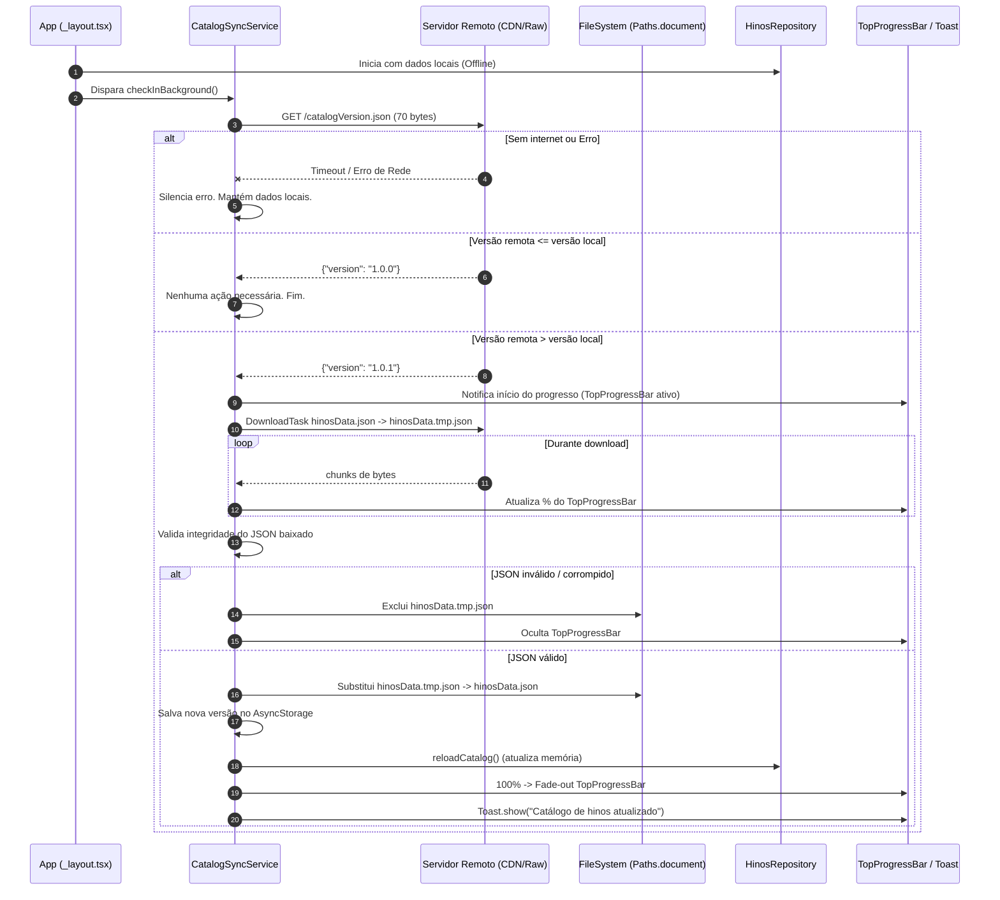

# Design Spec: Versionamento e Atualização Remota do Catálogo de Hinos

**Data:** 08/09/2026  
**Status:** Aprovado  
**Autor:** Antigravity & Caio  

---

## 1. Visão Geral e Motivação

Atualmente, o aplicativo empacota o catálogo completo de hinos em `data/hinosData.json` (~762 KB) no bundle local. Quando novas edições, correções de letras ou novos hinos forem lançados, o aplicativo deve ser capaz de atualizar esse catálogo de forma remota, mantendo seu funcionamento **100% offline-first**.

### Problema Identificado
Se o aplicativo baixasse o arquivo completo de hinos a cada abertura apenas para verificar se há novidades, gastaria banda e dados móveis desnecessariamente (~762 KB por abertura).

### Solução
Separar a verificação de versão em um arquivo de metadados ultraleve (`catalogVersion.json`, ~70 bytes). O aplicativo abre instantaneamente no modo offline, consulta a versão em segundo plano e, apenas se houver uma versão mais recente:
1. Executa o download atômico em background exibindo uma barra fina de progresso no topo (estilo NProgress) usando as cores do sistema (`THEME_COLORS`).
2. Valida a integridade do JSON baixado em um arquivo temporário antes de substituir o arquivo definitivo offline em disco (`Paths.document`).
3. Ao concluir, utiliza o `Toast` existente (`components/ui/Toast.ts`) para notificar o usuário discretamente.
4. Atualiza a memória reativamente sem interromper a navegação do usuário.

---

## 2. Arquitetura e Estrutura de Arquivos

### 2.1 Novos Arquivos e Modificações

| Arquivo | Tipo | Descrição |
|---|---|---|
| `data/catalogVersion.json` | Novo | Arquivo local com a versão empacotada de fábrica (ex: `{"version": "1.0.0", "updatedAt": "2026-09-08"}`). |
| `constants/catalogConfig.ts` | Novo | URLs remotas (`VERSION_URL`, `DATA_URL`), chaves do `AsyncStorage` e timeouts. |
| `services/catalogSyncService.ts` | Novo | Lógica de verificação, download via `expo-file-system` (`DownloadTask`), validação de integridade e emissão de eventos de progresso. |
| `components/ui/TopProgressBar.tsx` | Novo | Barra de progresso sutil no topo absoluto da tela (estilo NProgress), animada via Reanimated, usando `THEME_COLORS.goldSoft` / `gold`. |
| `data/hinosRepository.ts` | Modificado | Suporte a carregamento a partir do arquivo persistido em `Paths.document` (com fallback no bundle) e método `reloadCatalog()`. |
| `app/_layout.tsx` | Modificado | Monta o `TopProgressBar` e dispara a rotina de sincronização em segundo plano no `useEffect`. |
| `components/ui/Toast.ts` | Existente | Reutilizado diretamente para avisar sobre a conclusão da atualização. |
| `services/__tests__/catalogSync.test.ts` | Novo | Testes unitários para comparação de versões, validação de JSON e tratamento de falhas. |

---

## 3. Fluxo de Dados e Ciclo de Vida



---

## 4. Detalhamento dos Componentes

### 4.1 Metadados de Versão (`catalogVersion.json`)
Estrutura simples e compatível com semver ou revisões incrementais:
```json
{
  "version": "1.0.0",
  "updatedAt": "2026-09-08T00:00:00Z",
  "description": "Catálogo inicial consolidado"
}
```

### 4.2 Configuração Remota (`constants/catalogConfig.ts`)
```typescript
export const CATALOG_CONFIG = {
  // URL base configurável via env ou fallback estático
  BASE_URL: process.env.EXPO_PUBLIC_CATALOG_URL || 'https://raw.githubusercontent.com/kcaiosouza/hinarioeav-igcg/main',
  VERSION_PATH: '/data/catalogVersion.json',
  DATA_PATH: '/data/hinosData.json',
  STORAGE_KEYS: {
    CATALOG_VERSION: '@hinos_catalog_version',
  },
  CHECK_TIMEOUT_MS: 5000,
};
```

### 4.3 Armazenamento Local e Fallback Atômico
- Diretório de destino: `Paths.document` (via `expo-file-system`).
- Arquivo persistido: `Paths.document.uri + '/hinosData.json'`.
- Arquivo temporário de download: `Paths.document.uri + '/hinosData.tmp.json'`.
- Na inicialização:
  1. `hinosRepository.ts` carrega imediatamente o catálogo (lendo do arquivo persistido se existir, ou do JSON empacotado).
  2. Todas as buscas e consultas síncronas (`getHino`, `findHinoAnyBook`, `getAllHymnsList`, etc.) continuam síncronas e rápidas.
  3. `reloadCatalog()` recarrega a referência em memória e avisa observadores cadastrados.

### 4.4 Barra de Progresso Superior (`TopProgressBar.tsx`)
- Componente não-bloqueante (`pointerEvents="none"`).
- Posicionado com `position: 'absolute'`, `top: 0`, `left: 0`, `right: 0`, `height: 3`, `zIndex: 9999`.
- Cores vindas de `constants/theme.ts`:
  - Indicador de progresso: `THEME_COLORS.goldSoft` / `THEME_COLORS.gold` com brilho sutil.
- Transições animadas com `react-native-reanimated` para garantir fluidez a 60fps sem sobrecarregar a thread JS.

### 4.5 Notificação de Conclusão
- Reutiliza o `Toast.show` existente em `components/ui/Toast.ts`.
- Mensagem: `"Catálogo de hinos atualizado"`.

---

## 5. Tratamento de Erros e Casos de Borda

1. **Sem Conexão ou Modo Avião**:
   - A requisição falha e é silenciada. Nenhuma mensagem de erro aparece para o usuário. O app continua funcionando normalmente com o catálogo offline.
2. **Queda de Conexão durante o Download**:
   - O `DownloadTask` é abortado ou lança erro.
   - O arquivo temporário `hinosData.tmp.json` é excluído se existir.
   - O arquivo definitivo existente não é tocado, garantindo zero risco de corrupção.
   - A barra de progresso faz fade-out sutil e desaparece.
3. **JSON Remoto Malformado**:
   - Antes de substituir o arquivo ativo, o serviço executa `JSON.parse()` e checa se as chaves principais (`hinos`, `canticos`, etc.) existem e possuem objetos.
   - Se a validação falhar, o download é descartado.
4. **Concorrência**:
   - Uma flag `isSyncing` interna impede requisições concorrentes ou duplicadas caso o app dispare múltiplos eventos de ciclo de vida.

---

## 6. Plano de Verificação e Testes

- **Testes Unitários (`catalogSync.test.ts`)**:
  - Comparação de versões semver: `1.0.1 > 1.0.0`, `1.0.0 == 1.0.0`, `1.0.0 < 1.0.1`.
  - Validador de integridade do catálogo: rejeitar payload vazio, string truncada, ou objeto sem as chaves esperadas.
  - Simulação do fluxo de sincronização:
    - Versão remota igual -> sem download, retorna `up-to-date`.
    - Falha de rede no version check -> encerra silenciosamente.
    - Nova versão disponível -> executa download para tmp, valida, move e atualiza versão local.
- **Validação Manual / Smoke Test**:
  - Abrir o app normalmente com rede ativa.
  - Testar cenário com versão remota mais alta e observar a barra no topo e o Toast de conclusão.
  - Abrir em modo offline (sem internet) e confirmar que o catálogo abre instantaneamente sem atraso ou erro.
