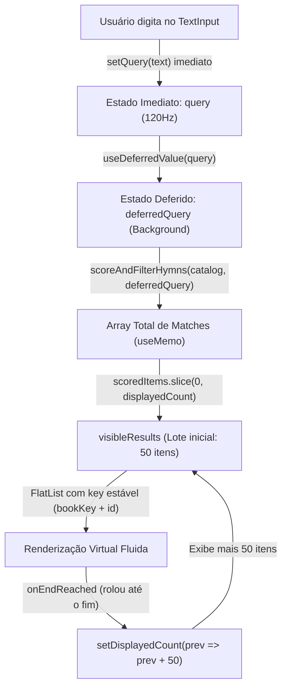

# Design Spec: Otimização de Performance e Paginação Virtual na Busca de Hinos

**Data:** 20/09/2026  
**Status:** Aprovado  
**Autor:** Antigravity & Caio  

---

## 1. Visão Geral e Motivação

Com a expansão do catálogo de hinos para 1.830 itens (hinários: Hinos, Cânticos, Suplemento, Hinário Novo e Diversos), a tela de busca (`app/search.tsx`) passou a apresentar atrasos e lentidão na digitação e atualização da lista em dispositivos móveis modernos (ex: Moto G56 5G e iPhone 11).

### Problemas Identificados (Causas Raízes)

1. **`keyExtractor` com `-index`:** A chave dos itens na `FlatList` continha o índice da lista (`${item.bookKey}-${item.number}-${index}`). Como a ordenação muda a cada caractere digitado, o React Native interpretava que todos os itens anteriores foram destruídos e criava novas Views nativas a cada letra, inviabilizando a virtualização.
2. **`React.memo(SearchItemCard)` ineficaz:** A cada filtro, novos objetos literais `{ ...item, snippet }` eram instanciados na memória. Como a verificação rasa de igualdade (`prevItem === nextItem`) sempre falhava, o `React.memo` nunca preveniu renderizações desnecessárias.
3. **Bloqueio Síncrono da Thread JavaScript (JS Thread):** O `TextInput` controlado atualizava a busca de forma 100% síncrona. Digitar rapidamente letras comuns (ex: `"a"`, `"e"`) acionava varreduras completas no texto de 1.830 hinos e re-renderizações simultâneas de toda a lista, represando eventos de teclado nativos.
4. **Falta de Paginação Incremental:** O array completo de até 1.830 itens era entregue de uma vez só à `FlatList`, gerando sobrecarga de medição e layout.

---

## 2. Arquitetura da Solução

### 2.1 Diagrama de Fluxo de Dados

### 2.2 Componentes e Responsabilidades

1. **Desacoplamento de Digitação e Filtragem (`useDeferredValue`):**
   * O `TextInput` continua ligado a `query` e `setQuery`, garantindo digitação instantânea sem nenhum atraso perceptual.
   * `const deferredQuery = useDeferredValue(query)` agenda o recálculo do filtro e renderização da lista como transição concorrente no React 19. Digitações rápidas consecutivas cancelam transições intermediárias em background.

2. **Paginação Incremental Inteligente (`displayedCount` = 50):**
   * Tamanho de página fixado em `50` (`PAGE_SIZE = 50`), garantindo preenchimento sem lacunas (gaps) mesmo em telas grandes de tablets (ex: iPads) e dobráveis.
   * Quando `deferredQuery` muda, `displayedCount` é resetado para `50`.
   * A `FlatList` consome apenas `visibleResults = useMemo(() => filteredResults.slice(0, displayedCount), [filteredResults, displayedCount])`.
   * Ao atingir o final da lista (`onEndReached` com limiar `0.5`), caso haja mais itens (`displayedCount < filteredResults.length`), `displayedCount` é incrementado em +50.

3. **Chave Estável e Virtualização:**
   * `keyExtractor={(item) => `${item.bookKey}-${item.id}`}`. Cada combinação `bookKey` + `id` é comprovadamente única em todo o acervo de 1.830 hinos.
   * Permite que a `FlatList` recicle as Views nativas sem destruição e recriação em massa.

4. **Memoização Real do `SearchItemCard`:**
   * `SearchItemCard` compara propriedades críticas (`id`, `title`, `bookName`, `snippet`, `number`) ou recebe propriedades estáveis, evitando re-renderização de cards que já estavam visíveis e inalterados.

5. **Isolamento da Lógica de Busca (`utils/searchHymns.ts`):**
   * Extração do algoritmo de pontuação e filtragem para módulo utilitário puro e testável.
   * Priorização direta por número de hino quando a busca for numérica, reduzindo o tempo de CPU.

6. **Preservação de UX (Fechamento de Teclado):**
   * `TouchableWithoutFeedback` no container raiz, `keyboardDismissMode="on-drag"`, toques na `topbar`, no `emptyContainer` e no `footerSpacer` continuam fechando o teclado e retirando o foco do input.

---

## 3. Estrutura de Arquivos

| Arquivo | Ação | Descrição |
|---|---|---|
| `utils/searchHymns.ts` | Novo | Função pura de busca, pontuação e formatação de snippets sobre o catálogo de hinos. |
| `utils/__tests__/searchHymns.test.ts` | Novo | Testes unitários de acurácia, pontuação, formatação de snippets e benchmark de performance (<15ms). |
| `app/search.tsx` | Modificado | Integração com `useDeferredValue`, paginação incremental (50 itens), chave estável e `React.memo` funcional. |

---

## 4. Estratégia de Testes e Critérios de Aceite

1. **Testes de Busca Unitários:**
   * Busca numérica: `"15"` deve ranquear no topo o hino 15 de cada livro.
   * Busca por título: `"graça"` deve priorizar títulos que contenham a palavra.
   * Busca por estrofe/letra: trecho textual deve retornar o snippet correto da estrofe ou coro onde ocorreu.
   * Performance: busca no acervo de 1.830 hinos deve executar em menos de 15ms.
2. **Critérios de Aceite na Interface:**
   * Digitação rápida no teclado virtual sem engasgos ou travamentos no Moto G56 e iPhone 11.
   * Primeira página com 50 itens; rolagem contínua adicionando +50 itens sem tela branca.
   * Reset para os primeiros 50 itens ao alterar o termo digitado.
   * Fechamento do teclado mantido ao tocar fora ou rolar.
   * `npm run typecheck` executando com zero erros.
